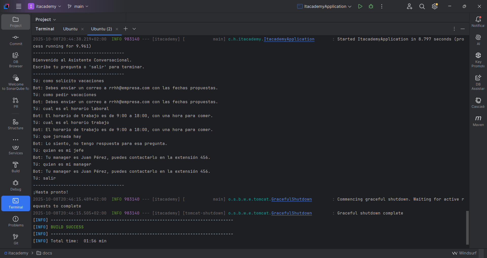
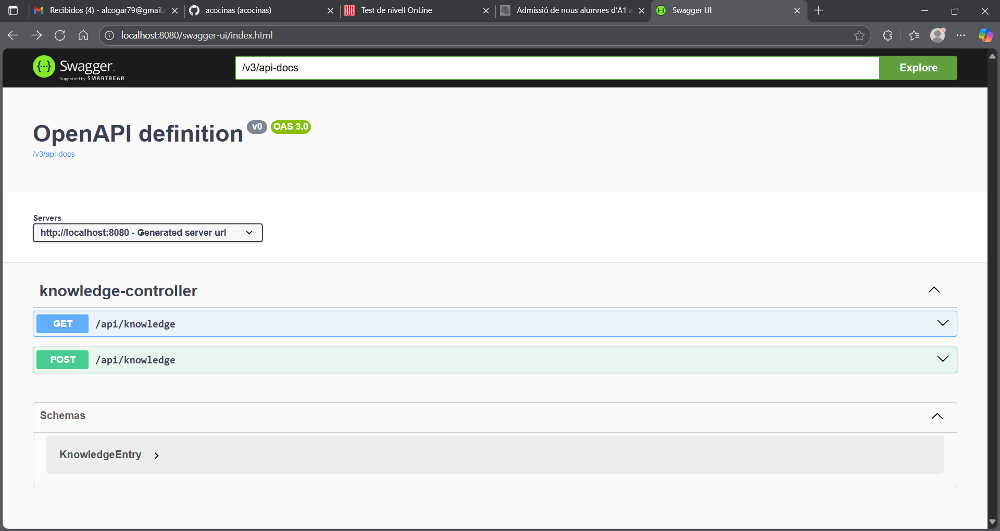
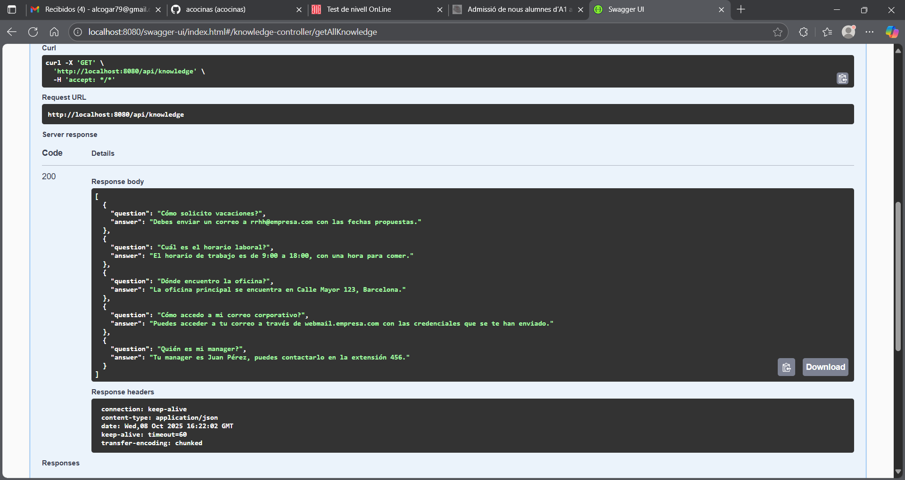
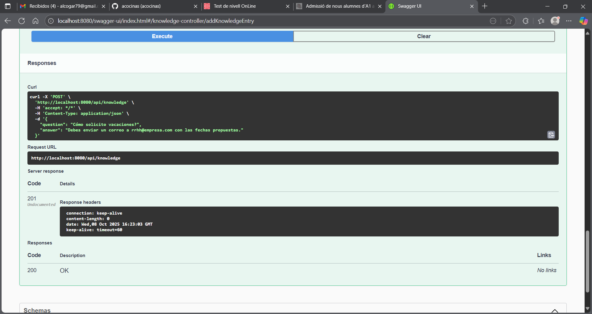
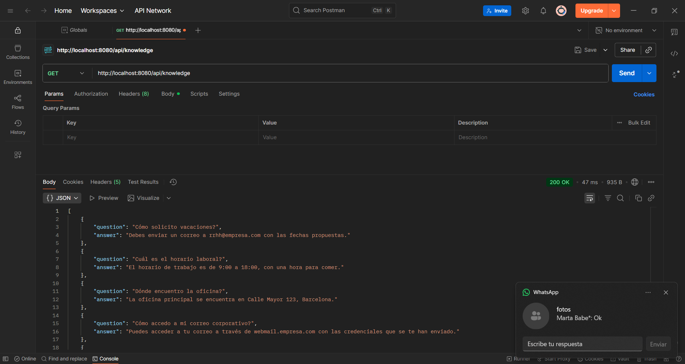
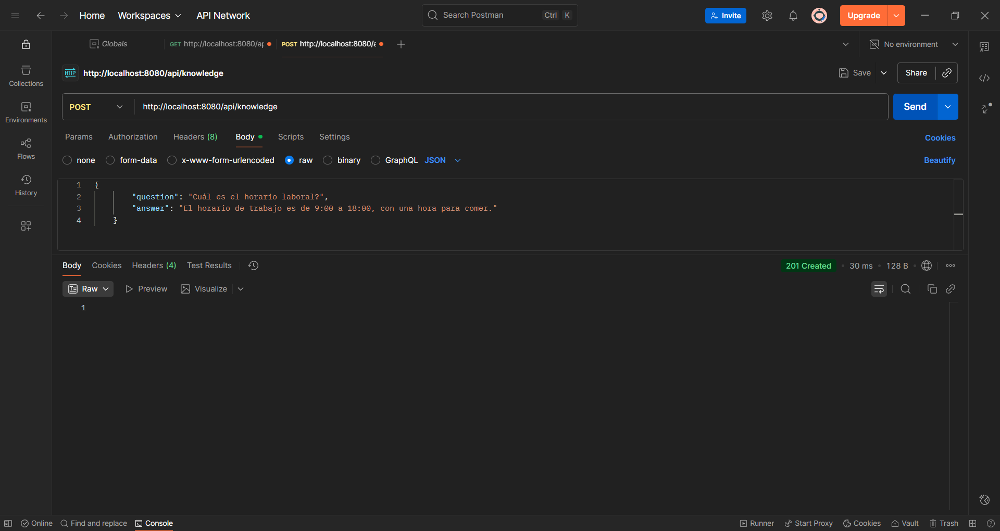

# Onboarding Bot Backend

### Project Overview

This project implements a simple conversational assistant designed to answer frequently asked questions related to a company's new employee onboarding process. The primary objective was to evaluate the ability to analyze a functional problem, propose a reasoned technical solution, and structure a clean, extensible, and well-organized project. The assistant is built as a backend service with two main interfaces: a console for user interaction and a REST API for administrative knowledge management.

## Functional Requirements

The core functionality of this project is to provide a conversational bot with a knowledge base of at least five representative questions and answers. The basic functionality includes:

* **Console-based Q&A:** Users can search for answers to questions via the console.
* **REST API for Knowledge Management:** An API is provided to globally insert and retrieve questions and answers.
* **Default Behavior:** The bot handles cases where no answer is found for a given question.

No extra functionalities such as authentication, advanced roles, or visual web interfaces were required.

### REST API Endpoints

The project includes a mandatory REST API with the following required endpoints:

* `GET /api/knowledge`: Returns all questions and answers from the bot's knowledge base.
* `POST /api/knowledge`: Adds a new knowledge entry to the base.

The API is documented with **Swagger/OpenAPI**, using the `springdoc-openapi` library, which integrates seamlessly with Spring Boot.

## Technical Architecture

The project is structured to follow best practices for a clean, modular, and maintainable application. The chosen architecture, inspired by **Hexagonal Architecture** principles, separates business logic from technical concerns.

* **Java (JDK 17+):** The project is built using Java, specifically targeting Java 21 for its latest features and stability.
* **Spring Boot:** Spring Boot was chosen as the framework for its clear layer-based structure, integrated testing capabilities, and streamlined dependency management.
* **Dependency Management:** **Maven** is used to manage project dependencies.
* **Persistence:** The bot's knowledge is persisted in a local **JSON file** (`knowledge.json`) to simulate a real-world data storage solution. This file is loaded automatically on application startup.
* **Package Organization:** The project is organized into clear, separated packages:
    * `domain`: Contains core business logic interfaces and data models (`KnowledgeService`, `KnowledgeRepository`, `KnowledgeEntry`).
    * `service`: Holds the implementation of the business logic (`DefaultKnowledgeService`).
    * `infrastructure`: Acts as the adapter layer, containing technology-specific implementations for persistence (`JsonKnowledgeRepository`), web (`KnowledgeController`), and console (`ConsoleRunner`) interactions.

## Installation and Execution

### Prerequisites

* **Java JDK 17 or higher** (Recommended: JDK 21)
* **Maven**

### Steps

1.  Clone the repository:
    ```bash
    git clone [https://github.com/acocinas/itAcademyHackaton.git](https://github.com/acocinas/itAcademyHackaton.git)
    cd itAcademyHackaton
    ```
2.  Run the application from the command line using Maven:
    ```bash
    ./mvnw spring-boot:run
    ```

## Usage Examples

### Console Interaction

Once the application is running, you can interact with the bot directly in the console. The bot uses a keyword-based search logic to find answers.



### REST API

The API can be tested using tools like **Swagger UI**, **Postman**, or `curl`.

#### API Documentation (Swagger UI)
The API is self-documenting. To view the interactive Swagger UI, open the following URL in your web browser after starting the application:
`http://localhost:8080/swagger-ui.html`





#### Testing with `curl`
* **GET all knowledge entries:**
    ```bash
    curl -X GET http://localhost:8080/api/knowledge
    ```
* **POST a new knowledge entry:**
    ```bash
    curl -X POST http://localhost:8080/api/knowledge \
    -H "Content-Type: application/json" \
    -d '{ "question": "What is the team meeting schedule?", "answer": "The next team meeting is on Friday at 10:00 AM." }'
    ```




## Application Testing

To execute all automated tests (both unit and integration tests), use the following Maven command:
```bash
./mvnw test

## Author
 * [@acocinas] (https://github.com/acocinas) 